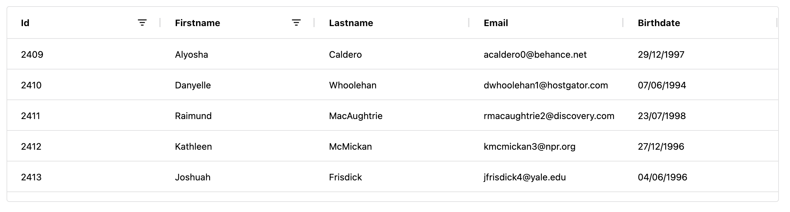
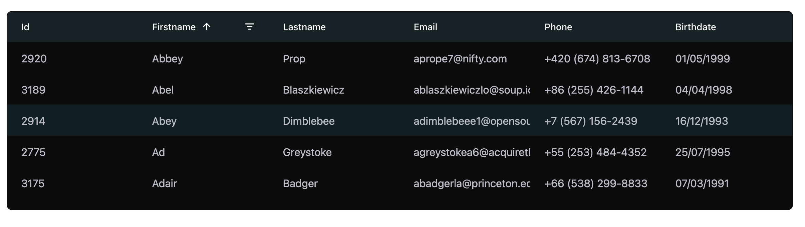

# Qodly AG Grid Component

## Overview

The Qodly AG Grid component is a powerful and flexible data grid for displaying and manipulating tabular data. It supports various features such as sorting, filtering, row selection, and more.





## Features

- **Multi-Sorting**: Hold the 'Shift' key and click on column headers to sort by multiple columns.
- **Filtering**: Supports text, number, and date filters.
- **Row Selection**: Single row selection is enabled by default.
- **Customizable**: Various settings to customize the appearance and behavior of the grid.
- **State Saving**: You can save the grid state (column order, sort and size) in a Qodly source, for example, saving it in the database.

## Save State

You can save the state of column visibility, Size and order using `Qodly Source` or `localStorage`:

- **Column Visibility**: Toggle column visibility, and changes will be automatically saved.
- **Column Size**: Change the Size of the column and make it suitable for your screen, the new sizes will be saved.
- **Column Order**: Reorder columns by dragging and dropping them, and the new order will be saved.

## Data Access

| Name                 | Type             | Required | Description                                                                                                      |
| -------------------- | ---------------- | -------- | ---------------------------------------------------------------------------------------------------------------- |
| Qodly Source         | Entity Selection | Yes      | Specifies the selection of entities to be displayed as data in the component                                     |
| Selected Element     | Entity           | No       | Each item of the virtualizer is featured by this property once it's selected                                     |
| State                | Array            | No       | Used to save the current states of the grid, such as selected rows, filters, or other contextual data            |
| Save in LocalStorage | boolean          | No       | Used to save the current states of the grid, such as selected rows, filters, or other contextual data            |
| Server Side          | string           | No       | When set to `true`, the component will store the grid state (e.g., column order, column sort) in `localStorage`. |

## Properties

The Qodly AG Grid component provides various properties to customize its appearance and behavior. Here are some of the key settings:

### General Settings

- **Disabled**: Disable the grid.
- **Class**: Add custom CSS classes.
- **Width**: Set the width of the grid.
- **Height**: Set the height of the grid.
- **Spacing**: Set the spacing between grid elements.
- **Accent Color**: Set the accent color.
- **Background Color**: Set the background color.
- **Text Color**: Set the text color.
- **Font Size**: Set the font size.

### Border Settings

- **Border Color**: Set the border color.
- **Border Radius**: Set the border radius.
- **Row Border**: Enable or disable row borders.
- **Column Border**: Enable or disable column borders.

### Header Settings

- **Header Background Color**: Set the header background color.
- **Header Text Color**: Set the header text color.
- **Header Vertical Padding Scale**: Set the vertical padding scale for headers.
- **Header Column Border**: Enable or disable column borders in the header.
- **Header Font Size**: Set the font size for headers.
- **Header Font Weight**: Set the font weight for headers.

### Cell Settings

- **Odd Row Background Color**: Set the background color for odd rows.
- **Cell Horizontal Padding Scale**: Set the horizontal padding scale for cells.
- **Row Vertical Padding Scale**: Set the vertical padding scale for rows.

### Icon Settings

- **Icon Size**: Set the size of icons.

## Events

The Qodly AG Grid component supports various events to handle user interactions:

- **On Select**: Triggered when a row is selected.
- **On Click**: Triggered when the grid is clicked.
- **On HeaderClick**: Triggered when a column header is clicked.
- **On CellClick**: Triggered when a cell is clicked.
- **On SaveState**: Triggered when the grid state is saved.

## Styling

If you are familiar with CSS, you can easily style your component using AG Grid's default CSS selectors. AG Grid provides a variety of classes that you can target to customize the appearance of the grid, headers, rows, cells, pagination, and more.

For more details: https://www.ag-grid.com/javascript-data-grid/theming-css/

For example:

```CSS
/* Change the grid background */
self {
    background-color: #f9f9f9;
}

/* Change header font, color, and add a bottom border */
self .ag-header-cell {
    background-color: #343a40;
    color: #ffffff;
    font-size: 16px;
    font-weight: bold;
    border-bottom: 2px solid #000;
}

/* Center align the header text */
self .ag-header-cell-label {
    justify-content: center;
}

/* Add spacing between header cells */
self .ag-header-cell:not(:last-child) {
    border-right: 1px solid #ffffff;
}

/* Style grid rows */
self .ag-row {
    font-size: 14px;
    border-bottom: 1px solid #ddd;
}

/* Change row height */
self .ag-row {
    height: 40px;
}

/* Add hover effect on rows */
self .ag-row:hover {
    background-color: #e6f7ff;
}

/* Alternate row colors for better readability */
self .ag-row:nth-child(even) {
    background-color: #f8f9fa;
}

self .ag-row:nth-child(odd) {
    background-color: #ffffff;
}


/* Increase padding inside cells */
self .ag-cell {
    padding: 12px;
    font-size: 14px;
}

/* Add a border between cells */
self .ag-cell:not(:last-child) {
    border-right: 1px solid #dee2e6;
}

/* Align text to the center */
self .ag-cell {
    text-align: center;
}

/* Change background color for selected rows */
self .ag-row-selected {
    background-color: #e3e3e300 !important;
    color: #ffffff;
}

/* Customize borders */
self .ag-root {
    border: 2px solid #ccc;
}

/* Change sort icon color */
self .ag-header-cell .ag-header-icon {
    color: #ffffff;
}

/* Change filter icon color */
self .ag-header-icon .ag-icon-filter {
    color: #ffffff;
}

/* Customize filter icon */
self .ag-header-cell-filtered .ag-header-cell-label::after {
    content: ' 🔍';
    margin: 4px;
}

/* Customize the scrollbar */
self .ag-body-viewport::-webkit-scrollbar {
    width: 8px;
}

self .ag-body-viewport::-webkit-scrollbar-thumb {
    background: #007bff;
    border-radius: 4px;
}

self .ag-body-viewport::-webkit-scrollbar-thumb:hover {
    background: #0056b3;
}

/* Add animation */
self .ag-header-cell-text {
    background: linear-gradient(90deg, red, orange, yellow, green, blue, indigo, violet, red);
    font-weight: 600;
    font-size: 20px;
    animation: animatedTextGradient 2.5s linear infinite;
    background-clip: text;
    -webkit-text-fill-color: transparent;
    background-size: 200% auto;
}

@keyframes animatedTextGradient {
    to {
        background-position: -200% center;
    }
}
```

Or you can change the CSS variables :

```CSS
self {
    /* override value of backgroundColor, foregroundColor and spacing parameters */
    --ag-background-color: darkred;
    --ag-foreground-color: lightpink;
    --ag-spacing: 4px;
    /* use dark scrollbars */
    --ag-browser-color-scheme: dark;
    /* use white text */
    --ag-text-color: white;
}
```

## License

This project is licensed under the MIT License.
